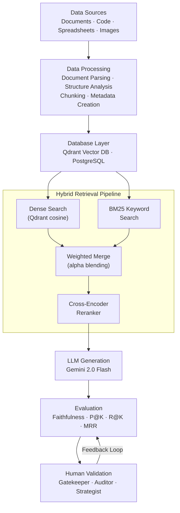

# RAG System — Production-Grade Retrieval-Augmented Generation

A standalone, production-grade RAG (Retrieval-Augmented Generation) system with multi-agent reasoning, adversarial stress testing, human validation, and a full evaluation pipeline.

This is an **independent project** built to serve as a robust, end-to-end intelligent document retrieval and generation platform. It is not designed as a plug-in for other projects — it is its own complete system.

---

## What This System Does

1. Ingest diverse data sources (documents, code, spreadsheets, images)
2. Parse, chunk, and enrich with metadata
3. Store in a hybrid database layer (vector + relational)
4. Route queries through a multi-agent system
5. Reason over retrieved context using a planning engine
6. Generate grounded, auditable answers via LLM
7. Evaluate quality and performance continuously
8. Stress-test against adversarial prompts
9. Gate outputs through human validation roles

---

## System Architecture



### Layer Breakdown

| Layer | Components | Responsibility |
|---|---|---|
| **Data Sources** | Documents, Code, Spreadsheets, Images | Raw input ingestion |
| **Data Processing** | Parser, Structure Analyzer, Chunker, Metadata Creator | Transform raw data into structured, retrievable units |
| **Database Layer** | Qdrant (vectors), PostgreSQL (metadata + logs) | Persist embeddings and structured metadata |
| **Hybrid Retrieval** | Dense (Qdrant) + BM25 keyword search | Dual-signal retrieval with weighted merge |
| **Reranking** | Cross-encoder (ms-marco-MiniLM-L-6-v2) | Reorder candidates by query-passage relevance |
| **Generation** | Gemini 2.0 Flash via LangChain | Grounded answer generation from context |
| **Evaluation** | LLM-as-Judge faithfulness, Precision@K, Recall@K, MRR | Measure retrieval + generation quality |
| **Human Validation** | Gatekeeper, Auditor, Strategist | Human-in-the-loop review and approval |

---

## Core API

```
POST /api/ingest              → Parse, chunk, embed, and store documents
POST /api/query               → Hybrid retrieve → rerank → generate
GET  /api/health              → System health check (Qdrant + Postgres)
POST /api/evaluate            → Run retrieval metrics (P@K, R@K, MRR)
GET  /api/evaluate/ground-truth  → Fetch evaluation dataset
POST /api/evaluate/ground-truth  → Upload evaluation dataset
```

---

## Tech Stack

| Category | Technology |
|---|---|
| **Backend** | Python 3.10+, FastAPI |
| **Orchestration** | LangChain, LangGraph |
| **Embeddings** | SentenceTransformers (BGE / MiniLM) |
| **Vector Store** | FAISS / ChromaDB |
| **Relational DB** | SQLite / PostgreSQL |
| **LLM** | Ollama (`llama3.2`) by default, OpenAI-compatible APIs, optional Gemini |
| **Evaluation** | LLM-as-Judge, RAGAS metrics |
| **Multi-Agent** | LangGraph agent graphs |

---

## Setup

```bash
# Clone the repo
git clone https://github.com/satyms/RAG-system.git
cd RAG-system

# Create and activate virtual environment
python -m venv rag
.\rag\Scripts\Activate.ps1   # Windows
# source rag/bin/activate     # macOS/Linux

# Install dependencies
pip install -r requirements.txt

# Pull the default Ollama model
ollama pull llama3.2

# Start the server
uvicorn app.main:app --reload
```

The API will be available at `http://localhost:8000`
API docs at `http://localhost:8000/docs`

By default, the app uses Ollama at `http://localhost:11434` with the `llama3.2` model.

---

## Project Structure

```
RAG-system/
│
├── app/
│   ├── api/routes/
│   │   ├── health.py        # Deep health check (Qdrant + Postgres)
│   │   ├── ingest.py        # File upload + ingestion pipeline
│   │   ├── query.py         # Hybrid retrieve → rerank → generate
│   │   └── evaluate.py      # Evaluation metrics endpoints
│   ├── core/
│   │   ├── ingestion.py     # Parse → chunk → embed → store
│   │   ├── embeddings.py    # BGE model with batching
│   │   ├── vector_store.py  # Qdrant CRUD operations
│   │   ├── bm25_search.py   # BM25 keyword search (in-memory)
│   │   ├── reranker.py      # Cross-encoder reranking
│   │   ├── retrieval.py     # Hybrid pipeline (dense + BM25 → rerank)
│   │   ├── generation.py    # Gemini LLM generation
│   │   ├── faithfulness.py  # LLM-as-judge groundedness check
│   │   └── evaluation.py    # P@K, R@K, MRR evaluation framework
│   ├── db/
│   │   ├── session.py       # Async SQLAlchemy engine + sessions
│   │   └── models.py        # Document, Chunk, QueryLog ORM models
│   ├── models/
│   │   └── schemas.py       # Pydantic request/response schemas
│   ├── utils/
│   │   ├── helpers.py        # File hash, sanitize filename
│   │   └── logging_config.py # JSON structured logging
│   ├── config.py            # Pydantic Settings (all config)
│   └── main.py              # FastAPI app with async lifespan
│
├── evaluation/              # Ground truth + eval results
├── static/                  # Ruixen AI frontend UI
├── uploads/                 # Uploaded documents
├── tests/                   # Unit + integration tests
├── docker-compose.yml       # Postgres + Qdrant + App
├── Dockerfile               # App container image
└── requirements.txt
```

---

## Data & Query Flow

**Ingestion:**
```
Raw Document → Parse → Chunk → Embed → Store (Vector DB + Metadata DB)
```

**Query (Phase 2 — Hybrid):**
```
User Query → Embed
  ├── Dense Search (Qdrant top-20)
  └── BM25 Keyword Search (top-20)
    → Weighted Merge (alpha=0.7) → Deduplicate
    → Cross-Encoder Rerank → Final top-5
    → Gemini LLM Generation
    → Faithfulness Evaluation (LLM-as-Judge)
    → Log to Postgres → Return Response
```

---

## Key Design Principles

* **Modular** — every layer is independently replaceable
* **Multi-agent** — specialized agents for different reasoning tasks
* **Adversarial-aware** — built-in stress testing against prompt injection, bias, and evasion
* **Human-in-the-loop** — gatekeeper / auditor / strategist validation layer
* **Observable** — LLM-as-Judge evaluation with precision, recall, latency, and cost metrics
* **Offline-capable** — runs fully local with open-source models

---

## Example Use Cases

* Enterprise Document Intelligence
* Legal Contract Analysis
* Medical Knowledge Assistant
* Codebase Q&A
* Research Paper Summarization
* Compliance & Audit Automation

---

## Roadmap

- [x] ~~Hybrid search (BM25 + dense vector)~~ ✅ Phase 2
- [x] ~~Cross-encoder reranking~~ ✅ Phase 2
- [x] ~~Retrieval evaluation (P@K, R@K, MRR)~~ ✅ Phase 2
- [x] ~~Faithfulness evaluation (LLM-as-Judge)~~ ✅ Phase 2
- [ ] Streaming responses
- [ ] Multi-tenant document namespaces
- [ ] Graph RAG (knowledge graph integration)
- [ ] Automated red-teaming pipeline
- [ ] Dashboard UI for evaluation metrics
- [ ] Full LangGraph multi-agent orchestration
- [ ] CI/CD with automated evaluation on PRs